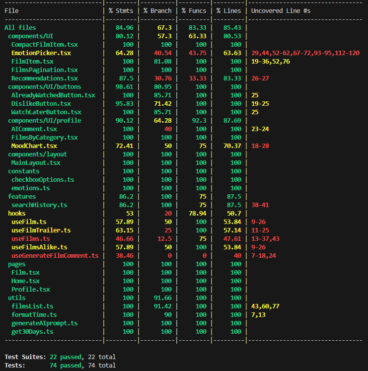
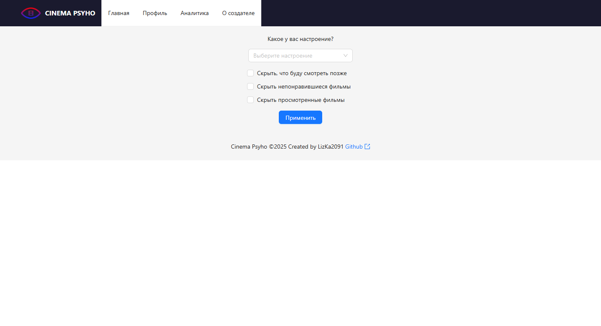
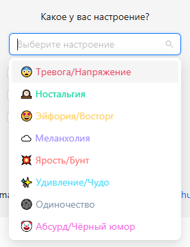
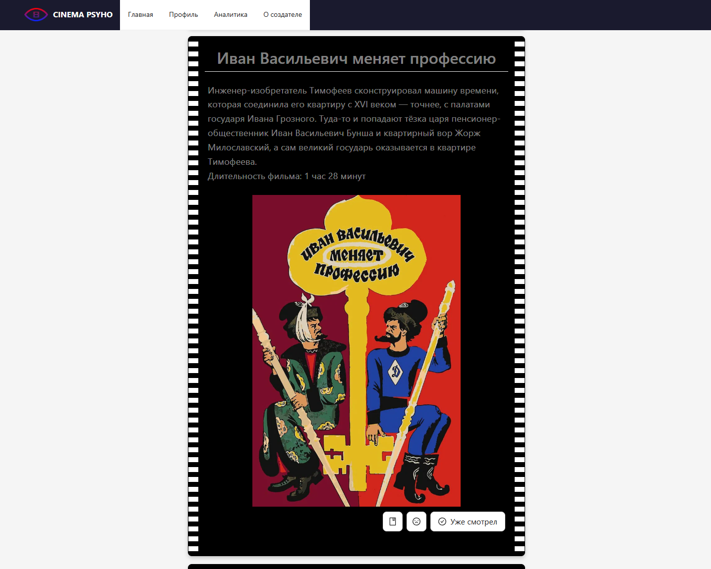
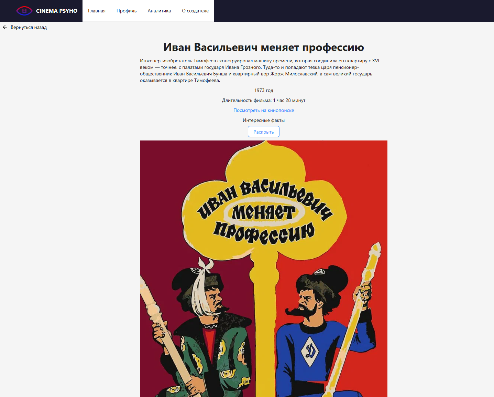
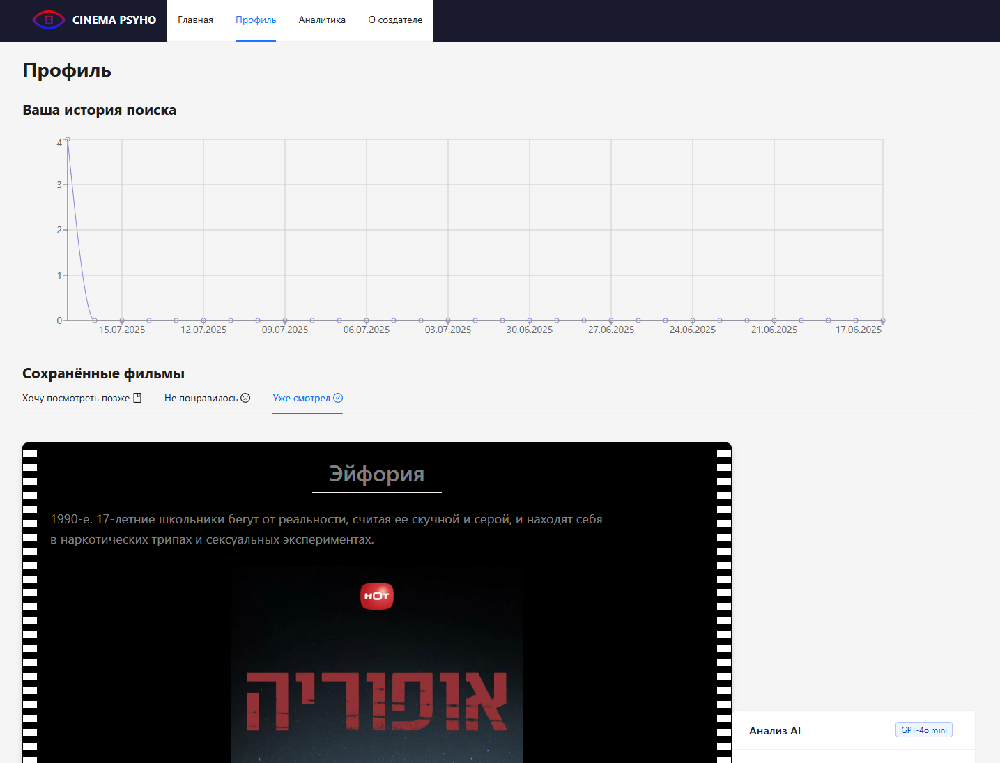

# 🎬 Cinema Psycho
Кино-сервис для тех, кто выбирает фильмы по настроению, а не по жанру

🔗 [Посмотреть проект на Vercel](https://cinema-psyho.vercel.app/)

## 📌 О проекте
Cinema Psycho — это приложение, которое рекомендует фильмы на основе эмоций. Пользователи отмечают, какие переживания хотят испытать (тревога, ностальгия), а сервис подбирает кино и анализирует их "кино-настроение" через оценки просмотренных фильмов

### Фишки:
- 🎭 Подбор фильмов по эмоциям, а не шаблонным жанрам
- 📊 Визуализация настроения через графики
- 💬 Генерация AI комментариев в духе "Вы часто смотрите тревожное кино по пятницам. Всё в порядке?"

## 🔨 Технологии
### Frontend
- React + TypeScript
- SCSS modules
- React Hook Form (формы с валидацией)
- React Query (работа с API и кеширование)
- Ant Design (UI-компоненты)
- React Router
- Context API (управление состоянием)
- Jest и React Testing Library (тестирование)

### Тестирование:
Проект покрыт тестами с использованием Jest и React Testing Library. Покрываемость отображена в виде таблицы:


## ⚠️ Важное требование перед запуском
Для работы проекта необходимо создать файл `.env` в директории `frontend`, добавить API-ключ Кинопоиска:
```
REACT_APP_KINOPOISK_API_KEY=ваш_ключ_кинопоиска
```
Где взять ключ Кинопоиска:
1. Зарегистрируйтесь на API Кинопоиска (https://kinopoiskapiunofficial.tech/)
2. Получите ключ в личном кабинете
3. Создайте `.env` файл и сохраните в него ключ

и добавить API-ключ gen-api в файл `.env` директории `backend`:
```
GEN_API_KEY=ваш_ключ_gen_api
```
Где взять ключ gen-api :
1. Зарегистрируйтесь на API Кинопоиска (https://gen-api.ru/)
2. Получите ключ в личном кабинете
3. Создайте `.env` файл и сохраните в него ключ

## 📦 Запуск и установка проекта
Клонируйте репозиторий: <br />
```
git clone https://github.com/LizKa2091/cinema-psycho.git
```
### Frontend
Установите пакеты: <br />
```
cd frontend
```
```
npm install
```
```
npm start
```
Клиент будет доступен на http://localhost:3000

### Backend
Установите пакеты: <br />
```
cd backend
```
```
npm install
```
```
ts-node server.ts
```
Сервер будет доступен на http://localhost:8000

## 📸 Интерфейс
### Главная страница

### Выпадающее меню для выбора настроения

### Пример результатов поиска

### Карточка фильма

### Страница профиля


## 📬 Контакты
Telegram: https://t.me/lizka2091
Email: lizka4231@gmail.com
